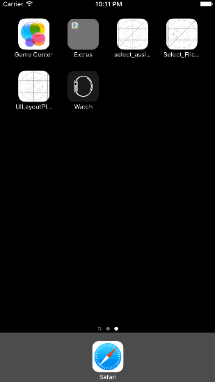

# Project 1 - Flicks

Flicks is a movies app using the [The Movie Database API](http://docs.themoviedb.apiary.io/#).

Time spent: 18 hours 

The following **required** functionality is completed:

- [x] User can view a list of movies currently playing in theaters. Poster images load asynchronously.
- [x] User can view movie details by tapping on a cell.
- [x] User sees loading state while waiting for the API.
- [x] User sees an error message when there is a network error.
- [] User can pull to refresh the movie list.

The following **optional** features are implemented:

- [x] Add a tab bar for **Now Playing** and **Top Rated** movies.
- [] Implement segmented control to switch between list view and grid view.
- [x] Add a search bar. (Next commit for assignment 3)
- [x] All images fade in.
- [x] For the large poster, load the low-res image first, switch to high-res when complete.
- [x] Customize the highlight and selection effect of the cell.
- [x] Customize the navigation bar.

## Video Walkthrough

Here's a walkthrough of implemented user stories:

GIF created with [LiceCap](http://www.cockos.com/licecap/).

## Notes

